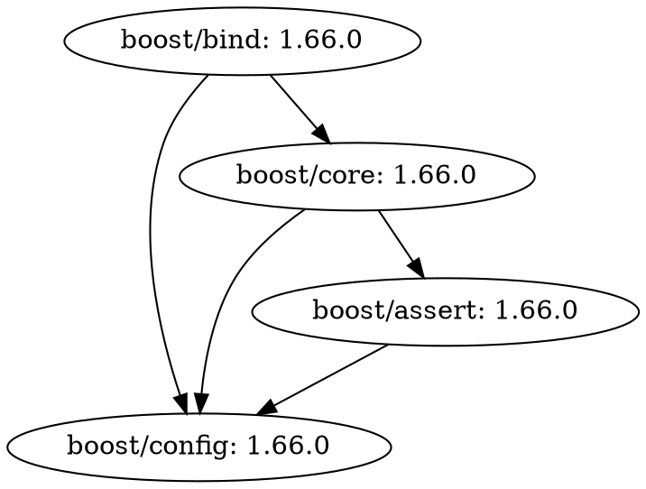

<div align="center">
  <picture>
    <source media="(prefers-color-scheme: dark)" srcset="https://user-images.githubusercontent.com/26405363/170157214-51b03bbd-cd29-432b-99ca-8f65c01f973e.svg">
    <source media="(prefers-color-scheme: light)" srcset="https://user-images.githubusercontent.com/26405363/170157184-e338188c-e4fa-4967-ac74-aba03aefa0bc.svg">
    
  </picture>
</div>

---

[](https://github.com/poac-dev/poac/releases)
[](LICENSE)
[](https://app.fossa.com/projects/git%2Bgithub.com%2Fpoac-dev%2Fpoac?ref=badge_shield)
[](https://zenodo.org/badge/latestdoi/119684778)
[](https://codecov.io/gh/poac-dev/poac)
[](https://www.codacy.com/gh/poac-dev/poac/dashboard?utm_source=github.com&amp;utm_medium=referral&amp;utm_content=poac-dev/poac&amp;utm_campaign=Badge_Grade)
[](https://www.codefactor.io/repository/github/poac-dev/poac)

## Description

Poac (pronounced as `/pəʊək/`) is a package manager for C++ users, inspired by Cargo for Rust.

Poac can download project's dependencies and compile a project.
Please visit [poac.dev](https://poac.dev) and [The Poac Book](https://doc.poac.dev) for more details.

## Demo

By using Poac, you can create a C++ project, build sources, and execute an application:


## Hello World

You can get started with just a few commands as the demo shows. Let's create a new Poac project as follows:

```console
you:~$ poac create hello_world
     Created binary (application) `hello_world` package
```

Then, you can use the `poac run` command to run your application:

```console
you:~$ cd hello_world
you:~/hello_world$ poac run
   Compiling 1/1: hello_world v0.1.0 (/Users/you/hello_world)
    Finished debug target(s) in 0.90s
     Running `/Users/you/hello_world/poac-out/debug/hello_world`
Hello, world!
```

## Installation

### Supported Operating Systems

|                                                                                   Linux                                                                                    |                                                                                   macOS                                                                                    |
|:--------------------------------------------------------------------------------------------------------------------------------------------------------------------------:|:--------------------------------------------------------------------------------------------------------------------------------------------------------------------------:|
| [](https://github.com/poac-dev/poac/actions?query=workflow%3A%22Linux%22) | [](https://github.com/poac-dev/poac/actions?query=workflow%3A%22macOS%22) |

Since packages through these providers may not be maintained by Poac owners, install them at your own risk.

[](https://repology.org/project/poac/versions)

Most package providers refer to Poac by that name. To install, simply use the command:

```sh
$PACKAGE_MANAGER install poac
```

Nevertheless, it's important to verify the package name and copy it accurately to prevent typosquatting attacks. You can check the correct name by following the link in [`Packaging status` (Repology)](https://repology.org/project/poac/versions).

### Build from source

If your environment is not included in the released packages, you have to construct Poac from the source. To build Poac, you will require the following compilers, tools, and libraries:

#### compilers

* Compilers which support [C++20](https://en.cppreference.com/w/cpp/20)
  * `GCC`: `11` or later
  * `Clang`: `12` or later
  * `Apple Clang`: provided by `macOS Big Sur (11)` or later

#### tools

* [`CMake`](https://gitlab.kitware.com/cmake/cmake): [`3.21`](https://gitlab.kitware.com/cmake/cmake/-/tree/v3.21.6) or later
* One of the following build systems
  * [`Ninja`](https://github.com/ninja-build/ninja) (recommended)
  * [`Make`](https://www.gnu.org/software/make/)
  * Something else supported by [`CMake Generator`](https://cmake.org/cmake/help/latest/manual/cmake-generators.7.html)

#### libraries

* [`boost`](https://github.com/boostorg): [`1.70.0`](https://github.com/boostorg/boost/releases/tag/boost-1.70.0) or later
  * algorithm
  * asio
  * beast
  * container_hash
  * dynamic_bitset
  * graph
  * predef
  * preprocessor
  * property_tree
  * range
  * regex
  * scope_exit
  * uuid
* [`openssl`](https://github.com/openssl/openssl): [`3.0.0`](https://github.com/openssl/openssl/releases/tag/openssl-3.0.0) or later
  * some `SHA256` functions are marked as [deprecated](https://github.com/openssl/openssl/blob/openssl-3.0.0/include/openssl/sha.h#L57-L79) since `3.0.0`

<details>
<summary>

> **Note**:
> When configuring with CMake, the following libraries will be installed automatically. Therefore, there is usually no need to be concerned about them. (click here to view additional dependencies.)
</summary>

---

**dependencies**

* [`fmt`](https://github.com/fmtlib/fmt): [`8.1.0`](https://github.com/fmtlib/fmt/releases/tag/8.1.0) or later
* [`git2-cpp`](https://github.com/ken-matsui/git2-cpp): [`0.1.1`](https://github.com/ken-matsui/git2-cpp/releases/tag/0.1.1) or later
* [`glob`](https://github.com/p-ranav/glob): [`v0.0.1`](https://github.com/p-ranav/glob/releases/tag/v0.0.1) or later
* [`libarchive`](https://github.com/libarchive/libarchive): [`v3.6.1`](https://github.com/libarchive/libarchive/tree/master) or later
  * requires [this commit](https://github.com/libarchive/libarchive/commit/a4c3c90bb828ab5f01589718266ac5d3fdccb854)
* [`libgit2`](https://github.com/libgit2/libgit2): [`v1.4.3`](https://github.com/libgit2/libgit2/releases/tag/v1.4.3) or later
  * requires security updates
* [`mitama-cpp-result`](https://github.com/LoliGothick/mitama-cpp-result): [`v9.3.0`](https://github.com/LoliGothick/mitama-cpp-result/releases/tag/v9.3.0) or later
  * requires [this commit](https://github.com/LoliGothick/mitama-cpp-result/commit/ec7f22ae921f750b0115681623d0c06223737819)
* [`ninja`](https://github.com/ninja-build/ninja): [`57b8fee`](https://github.com/ninja-build/ninja/commit/57b8fee639a4290176086f3839c78bfc0d02c42b) or later
  * requires [this commit](https://github.com/ninja-build/ninja/commit/57b8fee639a4290176086f3839c78bfc0d02c42b)
  * [`v1.11.1`](https://github.com/ninja-build/ninja/releases/tag/v1.11.1) does not include the commit
* [`spdlog`](https://github.com/gabime/spdlog): [`1.9.0`](https://github.com/gabime/spdlog/releases/tag/v1.9.0) or later
* [`structopt`](https://github.com/p-ranav/structopt): [`b1e1e16`](https://github.com/p-ranav/structopt/commit/b1e1e16867a5cf282664d392a18680cb5e3f6041) or later
  * requires [this commit](https://github.com/p-ranav/structopt/commit/b1e1e16867a5cf282664d392a18680cb5e3f6041)
  * awaiting the next release above [`v0.1.3`](https://github.com/p-ranav/structopt/releases/tag/v0.1.3)
* [`toml11`](https://github.com/ToruNiina/toml11): [`9086b11`](https://github.com/ToruNiina/toml11/commit/9086b1114f39a8fb10d08ca704771c2f9f247d02) or later
  * requires [this commit](https://github.com/ToruNiina/toml11/commit/9086b1114f39a8fb10d08ca704771c2f9f247d02)
  * awaiting the next release above [`v3.7.1`](https://github.com/ToruNiina/toml11/releases/tag/v3.7.1)

**dev-dependencies**

* [`μt`](https://github.com/boost-ext/ut): [`v1.1.9`](https://github.com/boost-ext/ut/releases/tag/v1.1.9) or later

---

</details>

Once you have all the necessary requirements in place, you can proceed to build Poac by executing the following commands:

```bash
git clone https://github.com/poac-dev/poac.git
cd poac
cmake -B build -G Ninja -DCMAKE_BUILD_TYPE=Release
cd build
ninja
ninja install
```

Poac attempts to utilize locally installed dependencies by default. To bypass the use of local packages, you can specify `-DCPM_USE_LOCAL_PACKAGES=OFF` as an option for the `cmake` command.

## Usage

### Start a new project with Poac

The `poac create` command lets you start a new Poac project:

```console
you:~$ poac create hello_world
     Created binary (application) `hello_world` package
```

> **Note**:
> If you want to integrate your existing project with Poac, use the `init` command:
> 
> ```console
> you:~/your-pj$ poac init
>      Created binary (application) `your-pj` package
> ```
> 
> This command just creates a `poac.toml` file not to break your project.

### Build the project

In most cases, you will want to execute a binary as well as build the project—of course, you can.

```console
you:~/hello_world$ poac run
   Compiling 1/1: hello_world v0.1.0 (/Users/you/hello_world)
    Finished debug target(s) in 0.90s
     Running `/Users/you/hello_world/poac-out/debug/hello_world`
Hello, world!
```

Should you just build it, run the `build` command:

```console
you:~/hello_world$ poac build
    Finished debug target(s) in 0.21s
```

Poac uses a cache since we executed the command with no changes.

### Install dependencies

Like Cargo for Rust does, Poac installs dependencies at build time.
However, Poac does not support [weired version specifiers](https://stackoverflow.com/q/22343224), such as `~` and `^`.
You can specify dependencies like:

`poac.toml`

```toml
[dependencies]
"boost/bind" = ">=1.64.0 and <2.0.0"
```

We regularly avoid auto updating packages to major versions which bring breaking changes, but minor and patch are acceptable.

> **Note**:
> If you would use a specific version, you can write the version as following:
>
> ```toml
> [dependencies]
> "boost/bind" = "1.66.0"
> ```

#### Conan V1 Registry

Poac also supports Conan V1 Registry. To use it:

`poac.toml`

```toml
[dependencies]
fmt = { version = "9.1.0", registry = "conan-v1" }
spdlog = { version = "1.10.0", registry = "conan-v1" }
leveldb = { version = "1.23", registry = "conan-v1" }
```

*The demo is publised on [wx257osn2/poac-conan-demo](https://github.com/wx257osn2/poac-conan-demo)*

After editing `poac.toml`, executing the `build` command will install the package and its dependencies.

```console
you:~/hello_world$ poac build
   Resolving dependencies ...
 Downloading packages ...
  Downloaded boost/bind v1.66.0
  Downloaded boost/core v1.66.0
  Downloaded boost/assert v1.66.0
  Downloaded boost/config v1.66.0
   Compiling 1/1: hello_world v0.1.0 (/Users/you/hello_world)
    Finished debug target(s) in 0.70s
```

To use this dependency, update the `main.cpp` file.

`src/main.cpp`

```cpp
#include <iostream>
#include <boost/bind.hpp>

int f(int a, int b) {
  return a + b;
}

int main(int argc, char** argv) {
  std::cout << boost::bind(f, 5, _1)(10) << std::endl;
}
```

You can now run this source code:

```console
you:~/hello_world$ poac run
   Compiling 1/1: hello_world v0.1.0 (/Users/you/hello_world)
    Finished debug target(s) in 0.50s
     Running `/Users/you/hello_world/poac-out/debug/hello_world`
15
```

> **Warning**:
> We currently support building a project with header-only dependencies.
> Building with build-required dependencies will be soon supported.

### Create a dependency graph

You can create a dependency graph by using the `graph` command:

```console
you:~/hello_world$ poac graph -o out.png
   Generated out.png
```


Or you can export the graph as a `.dot` file:

```console
you:~/hello_world$ poac graph -o out.dot
   Generated out.dot
```



> **Note**:
> When you want to export the graph as a `.png` file, please ensure `graphviz` is installed.

If you omit specifying the output path, then Poac emits the graph to standard output:

```console
you:~/hello_world$ poac graph
boost/bind -> boost/core
boost/bind -> boost/config
boost/core -> boost/assert
boost/core -> boost/config
boost/assert -> boost/config
```

### Run linter

Linting source code is essential to protect its quality.
Poac supports linting it by a simple command with `cpplint`:

```console
you:~/hello_world$ poac lint
     Linting hello_world
src/main.cpp:0:  No copyright message found.  You should have a line: "Copyright [year] <Copyright Owner>"  [legal/copyright] [5]
Done processing src/main.cpp
Total errors found: 1

Error: `cpplint` completed with exit code 1
```

> **Note**:
> If you do not have `cpplint`, install it with the following command:
>
> ```bash
> pip install cpplint
> ```

The `lint` command works without configurations, and Poac would automatically opt out of unwanted lints by adjusting to each project.
To customize the lint settings, try adding the `[lint.cpplint]` key in your `poac.toml` like [this](https://github.com/poac-dev/poac/blob/cc30b706fb49860903384df56d650a0955aca16c/poac.toml#L67-L83)
or creating a [`CPPLINT.cfg`](https://github.com/poac-dev/poac/blob/5e7e3792e8818d165149214e94f30958fb0fef66/CPPLINT.cfg) file to the repository root.

### Run formatter

Poac also supports formatting your source code with `clang-format`.
Ensure having installed `clang-format` before running this command.

```console
you:~/hello_world$ poac fmt
  Formatting hello_world
```

> **Note**:
> This command automatically detects what files we need to format to avoid bothering commands like:
>
> ```console
> $ # We need to avoid the `build` dir and such dirs ...
> $ clang-format ./src/*.cpp -i
> $ clang-format ./include/**/*.hpp -i
> $ clang-format ./tests/**/*.cpp -i
> $ ...
> ```

To customize the format settings, try creating a [`.clang-format`](/.clang-format) file to the repository root.

### Search packages

In case you would find what packages are provided, you can use the `search` command or visit [poac.dev](https://poac.dev).

```console
$ poac search func
boost/function = "1.66.0"               # Boost.org function module
boost/function_types = "1.66.0"         # Boost.org function_types module
boost/functional = "1.66.0"             # Boost.org functional module
```

### Publish packages

WIP

## Roadmap

Poac is still under development and may contain a bunch of bugs.

|                        Feature                      |       Status       |
|:---------------------------------------------------:|:------------------:|
|                 Install dependencies                | :white_check_mark: |
|     Build a project with header-only dependencies   | :white_check_mark: |
|               Support dev-dependencies              | :white_check_mark: |
| Build a project including separated headers & impls |                    |
|                   Publish packages                  |        WIP         |
|    Build a project with build-required dependencies |                    |
|               Build a project with CMake            |                    |

## Why Poac?

C++ is often considered a complex language and unconsciously avoided by many. The absence of a definitive package manager and the unfamiliar syntax of build systems like [CMake](https://cmake.org) make it seem difficult to set up a C++ environment, leaving people hesitant.

To simplify the process and allow users to develop applications and libraries without worrying about [CMake](https://cmake.org), I created a package manager and build system with an intuitive interface, similar to [npm](https://www.npmjs.com) and [Cargo](https://github.com/rust-lang/cargo). This allows developers to focus on learning C++ without any hindrances. Additionally, I aim to integrate with other build systems and package managers, providing a seamless transition between development environments.

### Naming Background

Poac is originated from `cpp` but designed to prioritize ease of typing and reduce strain on one hand as it will be frequently used as a command. Its name is ergonomically optimized to prevent the development of tenosynovitis.


Despite C++ often being overlooked for product development, I believe that Poac can help to promote it as a fun language. Amemiya and Mizutani argue that the sound of `/p/` is associated with a bright and soft impression among Japanese consonants (157)[^1]. In the same way, I believe that Poac's name can convey a similarly positive impression.

## Contributing

### Source Code Documentation

A source code documentation for Poac is generated by Doxygen every commit to the `main` branch:

https://dev.poac.dev

### Before submitting your PR

Please make sure to follow these steps:
> **Note**: I expect you to use the latest `clang-tidy` and `clang-format`.

#### Run linter (`cpplint`)

```bash
poac lint
```

#### Run formatter (`clang-format`)

```bash
poac fmt
```

#### Build with `clang-tidy`

Follow the instruction at [Build from source](#build-from-source).

These are also done when pre-push as specified in [`.githooks/pre-push`](/.githooks/pre-push).
In case you would skip these hooks, use the [`--no-verify`](https://git-scm.com/docs/git-commit#Documentation/git-commit.txt---no-verify) option.

---

This project exists thanks to all the people who contribute.

<a href="https://github.com/poac-dev/poac/graphs/contributors">
  
</a>

## License

Poac is licensed under the terms of the Apache License version 2.0.

Please see [LICENSE](LICENSE) for details.

[](https://app.fossa.com/projects/git%2Bgithub.com%2Fpoac-dev%2Fpoac?ref=badge_large)

### Third-party software

* boost - <https://github.com/boostorg/boost/blob/master/LICENSE_1_0.txt>
* fmt - <https://github.com/fmtlib/fmt/blob/master/LICENSE.rst>
* git2-cpp - <https://github.com/ken-matsui/git2-cpp/blob/main/LICENSE>
* glob - <https://github.com/p-ranav/glob/blob/master/LICENSE>
* libarchive - <https://github.com/libarchive/libarchive/blob/master/COPYING>
* libgit2 - <https://github.com/libgit2/libgit2/blob/master/COPYING>
* mitama-cpp-result - <https://github.com/LoliGothick/mitama-cpp-result/blob/master/LICENSE>
* ninja - <https://github.com/ninja-build/ninja/blob/master/COPYING>
* openssl - <https://github.com/openssl/openssl/blob/master/LICENSE.txt>
* spdlog - <https://github.com/gabime/spdlog/blob/v1.x/LICENSE>
* structopt - <https://github.com/p-ranav/structopt/blob/master/LICENSE>
* toml11 - <https://github.com/ToruNiina/toml11/blob/master/LICENSE>
* μt - <https://github.com/boost-ext/ut/blob/master/LICENSE.md>


[^1]: Amemiya, T., & Mizutani, S. (2006). On the Basic Affective Dimensions of Japanese Onomatopoeia and the Basic Level of Japanese Phonesthemes. 関西大学社会学部紀要, 37(2), 139–166. https://hdl.handle.net/10112/12311
